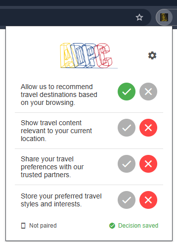
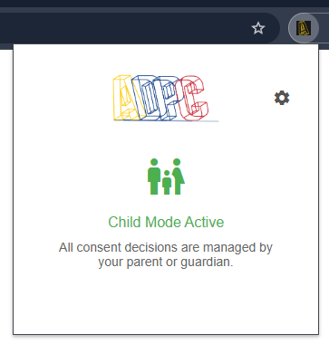
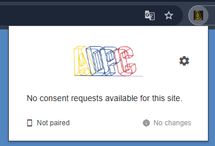
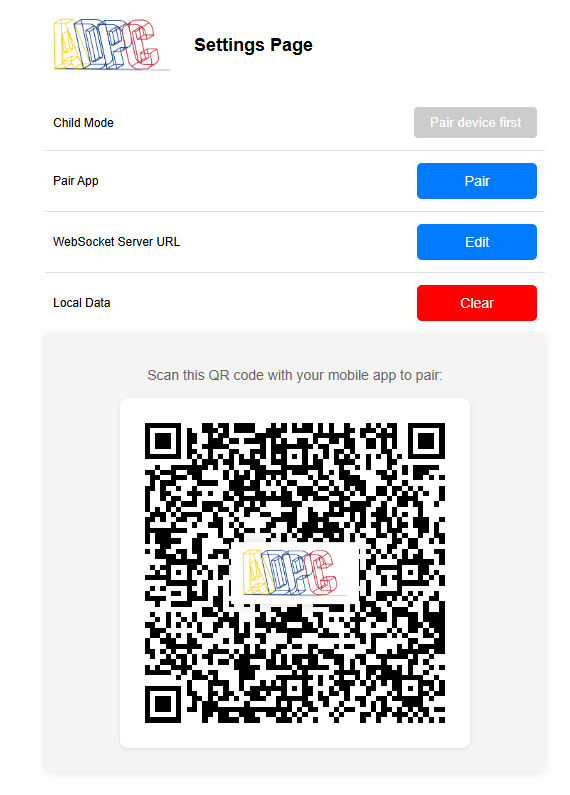
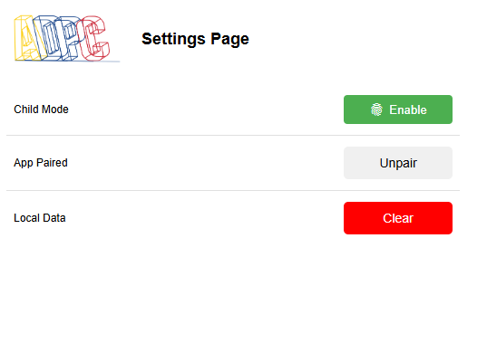
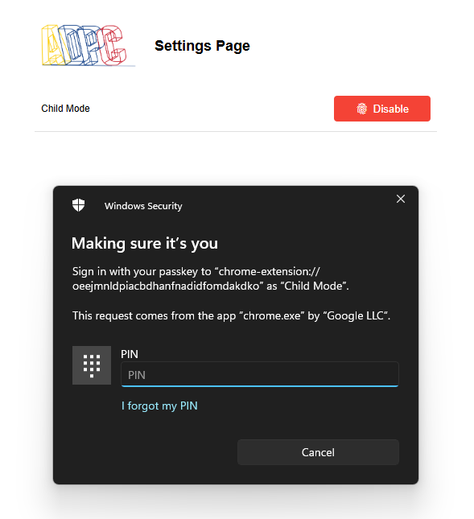

# ADPC Chromium Extension

## Overview

The ADPC Chromium Extension is a browser-based implementation of the Advanced Data Protection Control (ADPC) protocol. It enables users to manage their privacy preferences across websites by processing ADPC headers, displaying consent requests in a user-friendly popup, and communicating decisions back to web servers via HTTP headers.

## Key Features

- **ADPC Protocol Implementation**: Processes ADPC headers and records consent decisions per origin
- **Cross-Device Synchronization**: Make consent decisions from a paired mobile device via a signaling server
- **Child Mode**: Fully delegates consent decisions to a paired parent device — requires a compatible connected device (see note below)
- **Persistent Storage**: Maintains decisions across browsing sessions using local storage

## Screenshots

### Popup Interface
| With Consent Requests | Child Mode Active | No Consent Requests |
|:-------------------:|:---------------------:|:-----------------:|
|  |  |  |

### Settings Interface
| Pairing Screen | Successfully Paired | Disable Child Mode |
|:----------------:|:-------------------:|:-----------------:|
|  |  |  |

## Installation

1. Clone the repository:
   ```
   git clone https://github.com/Data-Protection-Control/ADPC-Kids-Browser-Extension.git
   ```
2. Open your Chromium-based browser and navigate to `chrome://extensions/`
3. Enable "Developer mode" in the top-right corner
4. Click "Load unpacked" and select the extension directory
5. The extension will appear in your browser toolbar

## Usage

### Basic Usage

1. Consent requests sent by websites appear in the extension popup
2. Approve or reject each request directly from the popup
3. Open settings by clicking the gear icon in the popup

### Pairing with a Mobile Device

1. Open the extension settings
2. Enter the address of a compatible signaling server
3. Click "Pair" and scan the displayed QR code with the ADPC mobile app

> **Note:** The ADPC mobile app is not yet publicly released. Pairing and Child Mode require a compatible device running a compatible build of the app connected to the same signaling server.

### Enabling Child Mode

> **Requires an active paired device.** Child Mode only works while a compatible mobile device is connected via the signaling server.

1. Open the extension settings
2. Ensure a device is paired and the signaling server is reachable
3. Click "Enable" under Child Mode and authenticate via Windows Hello or PIN
4. All consent decisions will be delegated to the paired device until Child Mode is disabled

## Architecture

The extension follows a modular architecture with a background service worker coordinating several specialized services:

- **Background Service Worker**: Central coordinator for all extension functionality
- **UI Components**: Popup and Settings interfaces
- **Core Services**:
  - WebSocket Service: Handles signaling server communication and cross-device sync
  - Consent Service: Processes ADPC headers and manages decisions
  - Storage Service: Maintains persistent data
  - Child Mode Service: Implements parental control functionality

## Related Projects

- [ADPC GitHub Organization](https://github.com/Data-Protection-Control)
- [ADPC Mobile App](https://github.com/Data-Protection-Control/ADPC-Mobile-App)
- [ADPC Protocol Specification](https://github.com/Data-Protection-Control/ADPC)
